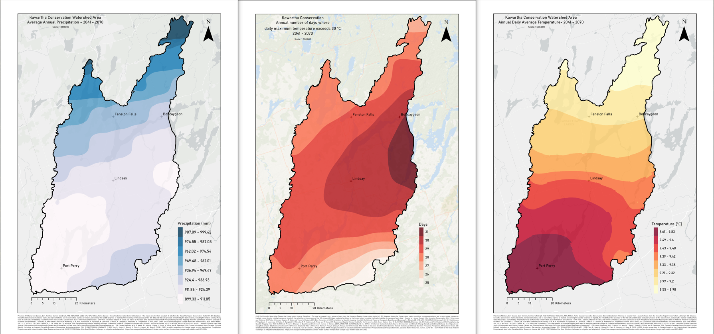

# Climate Data Analysis

This repository contains a Jupyter Notebook for analyzing climate data obtained through climatedata.ca.
The analysis focuses on various aspects of climate change, including temperature trends, precipitation patterns, and other relevant metrics.

## Contents

- **ClimateDataAnalysis.ipynb**: The main Jupyter Notebook containing the analysis code and visualizations.
- **LICENSE**: The license file for the repository.
- **README.md**: This file, providing an overview of the repository.
- **Trinity.png**: The Image file used in this Readme to showcase output possibilities.

## Getting Started

To get started with the analysis, follow these steps:

1. **Clone the repository**:
   ```bash
   git clone https://github.com/A-Charvin/climatedata.git
   ```
2. **Navigate to the repository directory**:
   ```bash
   cd climatedata
   ```
3. **Install the required dependencies**: ( It is recommended to use ArcGIS or Conda)
   ```bash
   pip install jupyter pandas numpy matplotlib
   ```
4. **Open the Jupyter Notebook**:
   ```bash
   jupyter notebook ClimateDataAnalysis.ipynb
   ```

## Usage

The Jupyter Notebook includes various sections for analyzing climate data. Each section contains code cells and visualizations to help understand different climate metrics.



## Contributing

Contributions are welcome! Please fork the repository and submit a pull request with your changes.


## License

This project is licensed under the MIT License - see the LICENSE file for details.

## Credits & References

> Kawartha Conservation General Disclaimer : The map is created from a subset of data from the Kawartha Region Conservation Authority's GIS database. Kawartha Conservation makes no claims, no representations, and no warranties, express or implied, concerning the validity (express or implied), the reliability or the accuracy of the GIS data and GIS data products furnished by the Conservation, including the implied validity of any uses of such data. | Created by : Anand Charvin G for Kawartha Conservation 2024 | References and Citations : We wish to thank ClimateData.ca for providing the climate information used in this project. ClimateData.ca was created through a collaboration between the Pacific Climate Impacts Consortium (PCIC), Ouranos Inc., the Prairie Climate Centre (PCC), Environment and Climate Change Canada (ECCC) Centre de Recherche Informatique de Montréal (CRIM) and Habitat7. | CMIP Alex J. Cannon, Stephen R. Sobie, and Trevor Q. Murdock, 2015: Bias Correction of GCM Precipitation by Quantile Mapping: How Well Do Methods Preserve Changes in Quantiles and Extremes?. J. Climate, 28, 6938–6959. | ANUSPLIN :McKenney, D. W., M. F. Hutchinson, P. Papadopol, K. Lawrence, J. Pedlar, K. Campbell, E. Milewska, R. F. Hopkinson, D. Price, and T. Owen, 2011: Customized Spatial Climate Models for North America. Bull. Amer. Meteor. Soc., 92 12, 1611-1622. | BCCAQv2 Cannon, A.J., S.R. Sobie, and T.Q. Murdock, 2015: Precipitation by Quantile Mapping: How Well Do Methods Preserve Changes in Quantiles and Extremes? Journal of Climate, 28(17), 6938-6959, doi:10.1175/JCLI-D-14- 00754.1. | Historical Station Data Data Source: Environment and Climate Change Canada and (ClimateData.ca) See: https://eccc-msc.github.io/open-data/licence/readme_en/  | IDF Curves Shephard, M.W., E. Mekis, R.J., Morris, Y. Feng, X. Zhang, K. Kilcup, and R. Fleetwood, 2014: Trends in Canadian Short-Duration Extreme Rainfall: Including an Intensity-Duration-Frequency Perspective, Atmosphere-Ocean, DOI: 10.1080/07055900.2014.969677. | SPEI Tam B, Szeto K, Bonsal B, Flato G, Cannon AJ, Rong R (2018): CMIP5 drought projections in Canada based on the Standardized Precipitation Evapotranspiration Index, Canadian Water Resources Journal, 44, 90-107. | SSP2 Middle of the Road (Medium challenges to mitigation and adaptation) : https://sos.noaa.gov/catalog/datasets/climate-model-surface-temperature-change-ssp2-middle-road-2015-2100/
